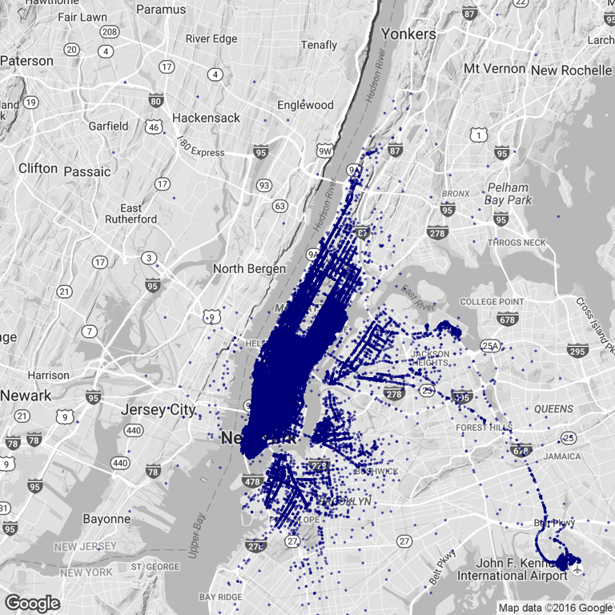
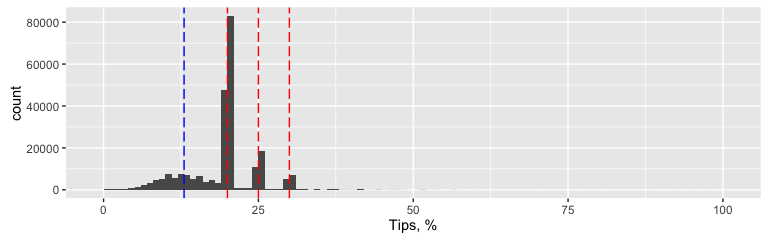
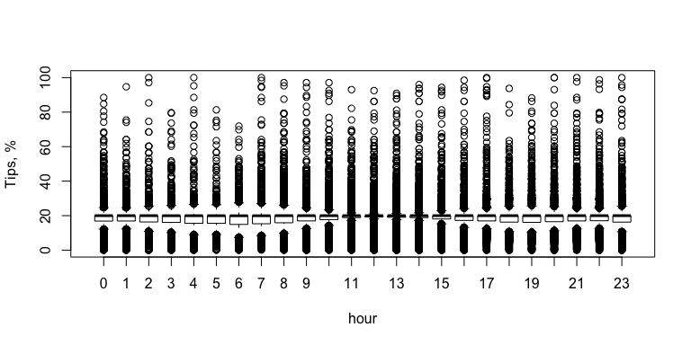
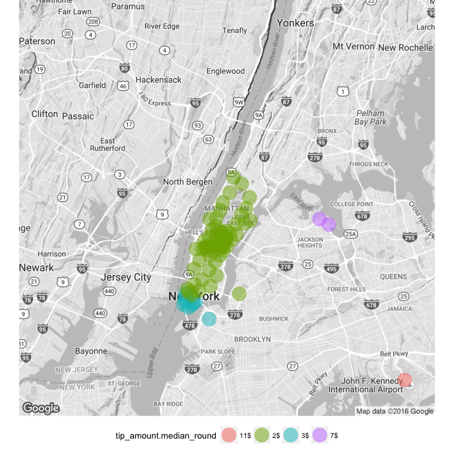
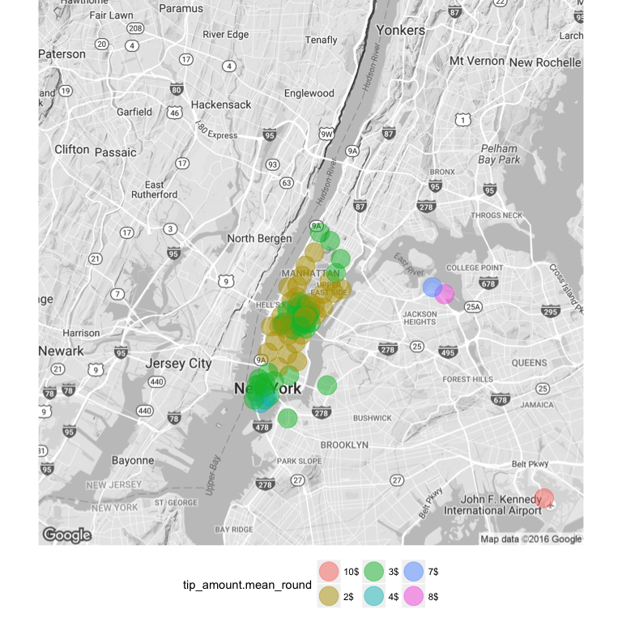
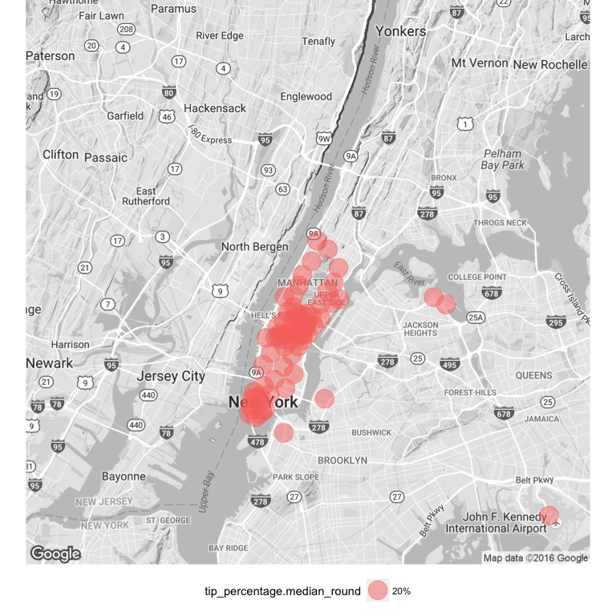
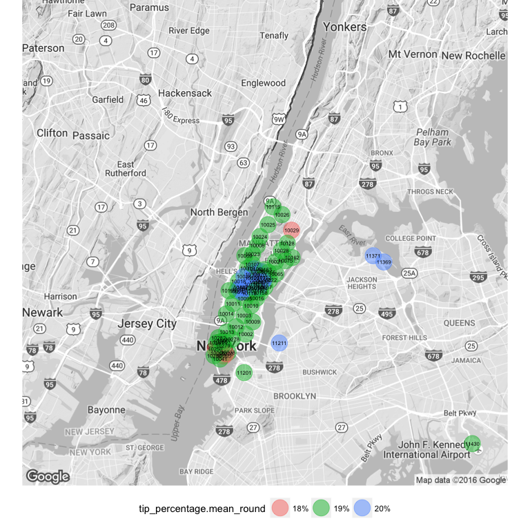
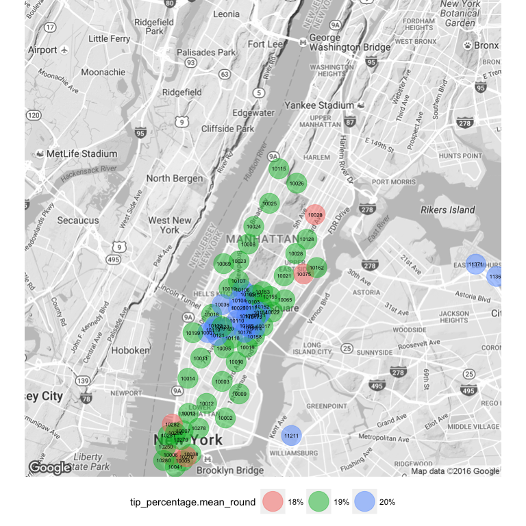

NYC TAXI TRIPS
==============

Are there some areas in NYC, traveling from which people pay more tips?
=======================================================================

``` r
source("data_preparation.r")
```

    ## Loading required package: ggplot2
    ## deldir 0.1-12

1. Download dataset
-------------------

The dataset (csv) can be downloaded from [BigQuery](https://bigquery.cloud.google.com/table/nyc-tlc:yellow.trips_2015_07). You first need to export it to your Google Storage bucket (several CSV files are generated of 255MB), from where the files can be downloaded on a local machine. For the simplicity of obtaining the table we analyse the data for July, 2015.

``` r
trips = read.csv("yellow2015_07000000000000.csv")
str(trips)
```

    ## 'data.frame':    1927032 obs. of  19 variables:
    ##  $ vendor_id         : int  2 2 2 2 2 2 2 2 2 1 ...
    ##  $ pickup_datetime   : Factor w/ 1306880 levels "2015-07-01 00:00:00 UTC",..: 511596 1287227 499301 460720 974167 1269984 809176 490960 79926 63912 ...
    ##  $ dropoff_datetime  : Factor w/ 1307229 levels "2015-07-01 00:00:00 UTC",..: 513274 1290084 498919 460796 974330 1269918 809966 491006 79980 63181 ...
    ##  $ passenger_count   : int  4 1 5 6 1 1 1 5 6 1 ...
    ##  $ trip_distance     : num  17.36 14.15 0.42 4.06 0.39 ...
    ##  $ pickup_longitude  : num  -73.8 -73.9 -73.9 -74 -73.9 ...
    ##  $ pickup_latitude   : num  40.6 40.7 40.8 40.8 40.8 ...
    ##  $ rate_code         : int  2 1 1 1 1 1 1 1 1 5 ...
    ##  $ store_and_fwd_flag: Factor w/ 2 levels "N","Y": 1 1 1 1 1 1 1 1 1 1 ...
    ##  $ dropoff_longitude : num  -74 -73.9 -73.9 -74 -73.9 ...
    ##  $ dropoff_latitude  : num  40.8 40.7 40.8 40.7 40.8 ...
    ##  $ payment_type      : int  2 2 2 1 2 2 2 2 2 1 ...
    ##  $ fare_amount       : num  0 0 0 0 0 0 0 0 0 0 ...
    ##  $ extra             : num  0 0 0 0 0 0 0 0 0 0 ...
    ##  $ mta_tax           : num  0.5 0 0 0 0 0 0 0 0.5 0 ...
    ##  $ tip_amount        : num  0 0 0 0 0 0 0 0 0 5.7 ...
    ##  $ tolls_amount      : num  0 0 0 0 0 0 0 0 0 0 ...
    ##  $ imp_surcharge     : num  0.3 0 0 0 0 0 0 0 0.3 0.3 ...
    ##  $ total_amount      : num  0 0 0 0 0 0 0 0 0 6 ...

A description of what each column means is given here: [Data dictionary](http://www.nyc.gov/html/tlc/downloads/pdf/data_dictionary_trip_records_yellow.pdf)

2. Format columns
-----------------

Now we want to make sure that columns in our dataset are of appropriate types:

``` r
trips_prepared <- prepare_data(trips)
```

3. Remove inconsistent records
------------------------------

Now we want to make sure we do not have records with broken data

``` r
trips_cleaned <- clean_data(trips_prepared)
```

4. Sampling data
----------------

It is hard to work with millions of records on a laptop, so we randomly select 250 000 trip records to work with (we believe it does not affect representability):

``` r
trips_short <- trips_cleaned[sample(nrow(trips_cleaned), 250000),]
str(trips_short)
```

    ## 'data.frame':    250000 obs. of  20 variables:
    ##  $ vendor_id         : Factor w/ 2 levels "1","2": 2 2 1 1 2 2 2 1 2 1 ...
    ##  $ pickup_datetime   : POSIXlt, format: "2015-07-16 22:03:44" "2015-07-03 13:39:46" ...
    ##  $ dropoff_datetime  : POSIXlt, format: "2015-07-16 22:10:38" "2015-07-03 13:55:32" ...
    ##  $ passenger_count   : int  1 2 1 1 4 1 1 1 5 2 ...
    ##  $ trip_distance     : num  1.58 3.53 3.3 11.6 0.4 5.3 2.23 1.7 0.85 1.5 ...
    ##  $ pickup_longitude  : num  -74 -74 -74 -74 -74 ...
    ##  $ pickup_latitude   : num  40.7 40.7 40.8 40.7 40.8 ...
    ##  $ rate_code         : Factor w/ 7 levels "1","2","3","4",..: 1 1 1 1 1 1 1 1 1 1 ...
    ##  $ store_and_fwd_flag: Factor w/ 2 levels "N","Y": 1 1 1 1 1 1 1 1 1 1 ...
    ##  $ dropoff_longitude : num  -74 -74 -74 -73.9 -74 ...
    ##  $ dropoff_latitude  : num  40.8 40.8 40.8 40.8 40.8 ...
    ##  $ payment_type      : Factor w/ 4 levels "1","2","3","4": 1 1 1 1 1 1 1 1 1 1 ...
    ##  $ fare_amount       : num  7.5 14.5 14 43 4 19.5 9.5 9.5 5.5 11.5 ...
    ##  $ extra             : num  0.5 0 0.5 0 0 0.5 0.5 1 0 0 ...
    ##  $ mta_tax           : num  0.5 0.5 0.5 0.5 0.5 0.5 0.5 0.5 0.5 0.5 ...
    ##  $ tip_amount        : num  1.76 2.7 3.05 10 1.44 4.16 3.24 2 1.26 2 ...
    ##  $ tolls_amount      : num  0 0 0 0 0 0 0 0 0 0 ...
    ##  $ imp_surcharge     : num  0.3 0.3 0.3 0.3 0.3 0.3 0.3 0.3 0.3 0.3 ...
    ##  $ total_amount      : num  10.56 18 18.35 53.8 6.24 ...
    ##  $ tip_percentage    : num  20 17.6 19.9 22.8 30 ...

5. Explore data
---------------

Let's see how our trips are spread geographically:

    ## Map from URL : http://maps.googleapis.com/maps/api/staticmap?center=Manhattan+New+York&zoom=11&size=640x640&scale=2&maptype=terrain&language=en-EN&sensor=false
    ## Information from URL : http://maps.googleapis.com/maps/api/geocode/json?address=Manhattan%20New%20York&sensor=false

    ## Warning: Removed 34 rows containing missing values (geom_point).



Let's see how tip percentages look like:

    ##     Min.  1st Qu.   Median     Mean  3rd Qu.     Max. 
    ##     0.01    17.05    20.00    19.80    20.00 29330.00

The maximum value seems to be extreme. Let's see how extreme are the top percentiles:

``` r
quantile(trips_short$tip_percentage,c(0.95,0.99,0.999))
```

    ##       95%       99%     99.9% 
    ##  29.67480  34.09091 103.17488

To make our data more consistent we remove all records with tips greater than 100%:

``` r
trips_short <- trips_short[trips_short$tip_percentage<=100,]
```

``` r
ggplot(data = trips_short, aes(x = tip_percentage))+xlab("Tips, %") + geom_histogram(binwidth = 1) + geom_vline(xintercept = c(20,25,30), col = "red",linetype = "longdash") + geom_vline(xintercept = c(13), col = "blue",linetype = "longdash")
```



We see 3 clear spikes: 20%, 25%, 30%, which refer to suggested tips on payment machine screen. If we remove the records causing these spikes, the distribution will be normal with the mean around 13%.

Let's see if time of the day affects tips people pay:

``` r
plot(as.factor(trips_short$pickup_datetime$hour), trips_short$tip_percentage, xlab = "hour", ylab="Tips, %")
```



It seems that during lunch time the InterQuartile range is smaller, making people more consistent in the amount of tips they leave.

Now let's see if there are any variables affecting the tip\_percentage people pay (assuming the dependency is linear):

    ## 
    ## Call:
    ## lm(formula = tip_percentage ~ trip_distance + pickup_datetime$hour + 
    ##     pickup_datetime$yday + pickup_longitude + pickup_latitude + 
    ##     trip_distance + passenger_count, data = trips_short)
    ## 
    ## Residuals:
    ##     Min      1Q  Median      3Q     Max 
    ## -19.987  -2.264   0.637   1.203  83.276 
    ## 
    ## Coefficients:
    ##                        Estimate Std. Error t value Pr(>|t|)    
    ## (Intercept)          539.769443  36.050848  14.972  < 2e-16 ***
    ## trip_distance         -0.129574   0.004189 -30.933  < 2e-16 ***
    ## pickup_datetime$hour  -0.003530   0.001832  -1.927   0.0540 .  
    ## pickup_datetime$yday  -0.001601   0.001378  -1.162   0.2453    
    ## pickup_longitude       6.304339   0.393750  16.011  < 2e-16 ***
    ## pickup_latitude       -1.313044   0.472955  -2.776   0.0055 ** 
    ## passenger_count        0.036227   0.009083   3.989 6.65e-05 ***
    ## ---
    ## Signif. codes:  0 '***' 0.001 '**' 0.01 '*' 0.05 '.' 0.1 ' ' 1
    ## 
    ## Residual standard error: 6.063 on 249726 degrees of freedom
    ## Multiple R-squared:  0.004049,   Adjusted R-squared:  0.004025 
    ## F-statistic: 169.2 on 6 and 249726 DF,  p-value: < 2.2e-16

R squared is very small so this linear regression does not represent well out dataset, even taking into account we have some statistically significant p-values for slopes of some variables.

We are primarily interested in how geographical location affect tip percentage, therefore further we split NYC into zones.

6. Group trips into NYC zones (ZIP codes)
-----------------------------------------

There are different ways we could group pickup coordinates to analyze aggregated data. We decide to map the coordinates to the nearest ZIP codes. For that we use the R package *Zipcodes*, and implement a function *getZipCode()* to augment every record with ZIP code information.

``` r
trips_short_zip <- augment_data(trips_short)
```

We aggregate our records by zipcode (zone)

``` r
zones <- group_data(trips_short_zip)
str(zones)
```

    ## 'data.frame':    210 obs. of  12 variables:
    ##  $ zipcode                    : Factor w/ 210 levels "10001","10002",..: 1 2 3 4 5 6 7 8 9 10 ...
    ##  $ lat                        : num  40.8 40.7 40.7 40.7 40.7 ...
    ##  $ lon                        : num  -74 -74 -74 -74 -74 ...
    ##  $ amount                     : num  1401 5466 13326 1062 563 ...
    ##  $ tip_percentage.mean        : num  19.7 18.8 19.1 18.6 18.5 ...
    ##  $ tip_percentage.median      : num  20 20 20 20 20 ...
    ##  $ tip_amount.mean            : num  2.45 2.63 2.35 3.42 3.52 ...
    ##  $ tip_amount.median          : num  2 2.19 1.96 2.95 3 2.15 1.96 2 1.89 1.95 ...
    ##  $ tip_amount.mean_round      : Factor w/ 22 levels "0$","1$","10$",..: 10 14 10 14 17 14 10 10 10 10 ...
    ##  $ tip_amount.median_round    : Factor w/ 23 levels "0$","1$","10$",..: 11 11 11 15 15 11 11 11 11 11 ...
    ##  $ tip_percentage.median_round: Factor w/ 22 levels "10%","12%","15%",..: 9 9 9 9 9 9 9 9 9 9 ...
    ##  $ tip_percentage.mean_round  : Factor w/ 25 levels "10%","12%","13%",..: 10 8 8 8 7 8 8 8 8 8 ...

The lower the *amount* of records for a given zone we have the more extreme the aggregated values are in comparison to zones with more records. Because of that in our analysis we consider only zones with more than 500 records (500 is taken arbitrary as a big enough number of records).

``` r
zones <- zones[zones$amount >500,]
```

#### Median tips (in $) people pay traveling from certain NYC zones



From the picture it is clear people pay more tips traveling from airports (LaGuardia and JFK) and the south of Manhattan (simply because taxi fare is more expensive).

#### Mean tips (in $) people pay traveling from certain NYC zones



Here we clearly see some regions, such as Times Square, Financial district (south of Manhattan), the rest of Manhattan and 2 airports. Still we are less interested in absolute values of tips but more in percentage values.

#### Median tip percentages people pay traveling from certain NYC zones



It is very interesting that the big majority of travellers pay 20% tip, which is median in all NYC zones.

#### Mean tip percentages people pay traveling from certain NYC zones



This is exactly what we were looking for. It seems that there are really some areas (Times Square and LaGuardia), traveling from which people tend to pay more tips. The Manhattan area has many overlaps, let's zoom in.

#### Zoomed Manhattan Area

    ## Map from URL : http://maps.googleapis.com/maps/api/staticmap?center=Manhattan+New+York&zoom=12&size=640x640&scale=2&maptype=terrain&language=en-EN&sensor=false
    ## Information from URL : http://maps.googleapis.com/maps/api/geocode/json?address=Manhattan%20New%20York&sensor=false

    ## Warning: Removed 2 rows containing missing values (geom_point).

    ## Warning: Removed 2 rows containing missing values (geom_text).



We see that from **WorldTradeCenter** [ZIP: 10250](https://www.google.it/maps/place/40??42'36.0%22N+74??00'57.5%22W/@40.710004,-74.0181687,17z/data=!3m1!4b1!4m5!3m4!1s0x0:0x0!8m2!3d40.71!4d-74.01598?hl=en) people tend to pay in average **18% tip**.

From **JFK Airport** [ZIP: 10024](https://www.google.it/maps/place/New+York,+NY+10024,+USA/@40.7858182,-73.996241,14z/data=!3m1!4b1!4m5!3m4!1s0x89c25862915fae1d:0x82d8ab21c229bfe!8m2!3d40.7859464!4d-73.9741874?hl=en) people pay **19% tip**.

From **LaGuardia Airport** [ZIP: 11371](https://www.google.it/maps/place/New+York,+NY+11371,+USA/@40.7809106,-73.8885426,14z/data=!3m1!4b1!4m5!3m4!1s0x89c25f8eb3819a01:0x9c55729e06838673!8m2!3d40.7766392!4d-73.87425?hl=en) and **Times Square** [ZIP: 10036](https://www.google.it/maps/place/New+York,+NY+10036,+USA/@40.7611254,-74.0001543,15z/data=!3m1!4b1!4m5!3m4!1s0x89c2585393f82307:0xf7d56896de1566ed!8m2!3d40.7602619!4d-73.9932872?hl=en) people tend to pay **20% tip**.

7. Evaluation
-------------

Let's check how consistent these observations are.

``` r
WorldTradeCenter_10250 <- trips_short_zip[trips_short_zip$zipcode == "10250",]  
LaGuardia_11371 <- trips_short_zip[trips_short_zip$zipcode == "11371",]
TimesSquare_10036 <- trips_short_zip[trips_short_zip$zipcode == "10036",]
JFK_11430 <- trips_short_zip[trips_short_zip$zipcode == "11430",]
```

``` r
welch_test <- t.test(TimesSquare_10036$tip_percentage,WorldTradeCenter_10250$tip_percentage,alternative = "greater")
welch_test$p.value
```

    ## [1] 1.810699e-08

The Welch test shows that people starting from Times Square really tend to pay more tips (p-value=0). Let's check how much more they tend to pay:

``` r
cohen_distance <- cohen.d(TimesSquare_10036$tip_percentage,WorldTradeCenter_10250$tip_percentage)
cohen_distance$estimate
```

    ## Treatment 
    ## 0.1819663

Cohen's d is 0.18.

Let's compare two airports (JFK and LaGuardia):

``` r
welch_test <- t.test(LaGuardia_11371$tip_percentage,JFK_11430$tip_percentage,alternative = "greater")
welch_test$p.value
```

    ## [1] 2.992254e-18

**People taking taxis from LaGuardia airport seem to pay more than people from JFK (p-value=0)**.

``` r
cohen_distance <- cohen.d(LaGuardia_11371$tip_percentage,JFK_11430$tip_percentage)
cohen_distance$estimate
```

    ## Treatment 
    ## 0.1807705

Cohen's d is 0.18.

8. Conclusion
-------------

From the data we did not find zones in NYC traveling from which people would pay substantially different tips (in percentages). Without focusing on tiny details we can say that primarily people pay 20% tip (the most popular option on the payment device screen), which is the median value in all zones.

In some regions, such as Times Square and LaGuardia Airport we observe more outliers, paying a lot, affecting the mean value.

People do pay more in absolute values, traveling from airports (JFK and LaGuardia), but primarily because the taxi fare is higher.

People traveling from LaGuardia and TimesSquare tend to pay around 20% tips, while people traveling from World Trade Center tend to pay around 18%.

9. Limitations
--------------

We conducted the analysis only on a sample of reconds (250 000). We did not use the data about zones with less than 500 records. While we used ZIP codes for aggregating geographical data, potentially using another entity aggregation (e.g. small: blocks or large: heighborhoods) could lead to different results.

These and several other reasons create a bias in our conclusions.
